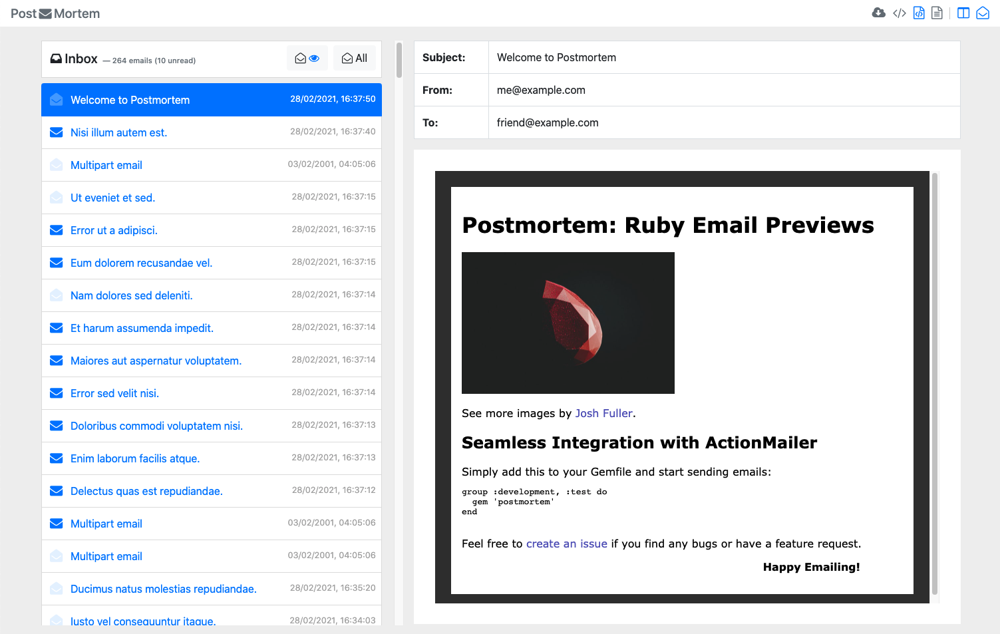

# PostMortem

_PostMortem_ provides a simple and clean preview of all outgoing mails sent by your _Ruby_ application to make email development a little less painful.

Every time your application sends an email a clearly-visible log entry will be written which provides a path to a temporary file containing your preview.

Take a look at a [live example](https://postmortem.surge.sh/) to see _PostMortem_ in action.

_PostMortem_ should only be enabled in test or development environments.

## Features

* Seamless integration with [_ActionMailer_](https://guides.rubyonrails.org/action_mailer_basics.html), [_Pony_](https://github.com/benprew/pony), [_Mail_](https://github.com/mikel/mail), etc.
* Email deliveries are always intercepted (can be configured to pass through).
* Live inbox monitors incoming emails so you can view them as soon as they are delivered.
* Preview email content as well as typical email headers (recipients, subject, etc.).
* View rendered _HTML_, plaintext, or _HTML_ source with syntax highlighting (courtesy of [highlight.js](https://highlightjs.org/)).
* Content is loaded inside an `<iframe>` to ensure document isolation and validity.
* Local images are located and embedded in HTML so you can see the full version of outgoing emails.
* Runs without a server - single page app runs on file system with no need to run a local web server to access UI.
* Any captured email can be downloaded into a standalone HTML file which can be shared with others.

## Installation

Add the gem to your application's Gemfile:

```ruby
group :development, :test do
  gem 'postmortem', '~> 0.2.4'
end
```

And then execute:

    $ bundle install

Or install it yourself as:

    $ gem install postmortem

## Usage

_PostMortem_ automatically integrates with _Rails ActionMailer_ and  _Pony_. When an email is sent an entry will be visible in your application's log output.

If you are using assets (images etc.) with _ActionMailer_ make sure to configure the asset host, e.g.:

```ruby
# config/environments/development.rb
Rails.application.configure do
  config.action_mailer.asset_host = 'http://localhost:3000'
end
```

A log entry will be generated every time an email is sent. Load the path provided in the log entry in your browser to launch _PostMortem_:



### Clearing the inbox

The inbox can be cleared at any time (e.g. at the start of a test run):

```ruby
Postmortem.clear_inbox
```

## Configuration
<a name="configuration"></a>

Configure _PostMortem_ by calling `Postmortem.configure`, e.g. in a _Rails_ initializer.

```ruby
# config/initializers/postmortem.rb
Postmortem.configure do |config|
  # Colorize output in logs (path to preview HTML file) to improve visibility (default: true).
  config.colorize = true

  # Path to the PostMortem log file, where preview paths are written (default: STDOUT).
  config.log_path = '/path/to/postmortem.log'

  # Path to save preview .html files (default: OS-provided temp directory).
  # The directory will be created if it does not exist.
  config.preview_directory = '/path/to/postmortem/directory'

  # Provide a custom layout path if the default interface does not suit you.
  # See `layout/default.html.erb` for implementation reference.
  config.layout = '/path/to/layout'

  # Skip delivery of emails when using Pony, Mail, etc. (default: true).
  config.mail_skip_delivery = true
end
```

## Contributing

Feel free to make a pull request.

## License

The gem is available as open source under the terms of the [MIT License](https://opensource.org/licenses/MIT).
